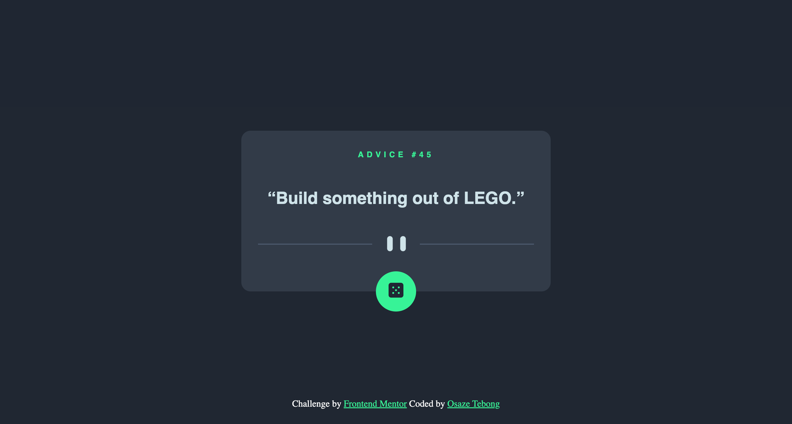
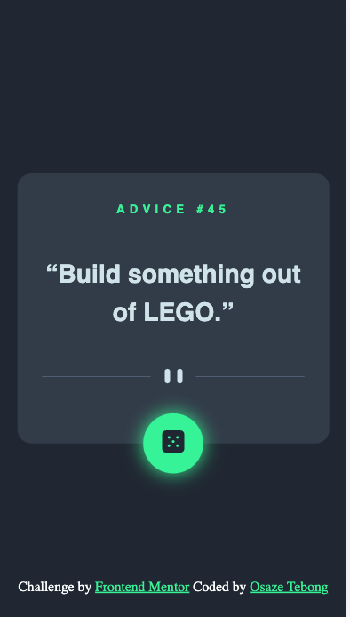

</>

<h1 align="center">Advice generator app</h1>

  <h3>
    <a href="https://osaze-ai.github.io/advice-slip-api/" color="white">
      Live
    </a>
  
     | 
    <a href="https://www.frontendmentor.io/solutions/advice-generator-using-advice-slip-api-ZbYknW_Ph2">
      Solution
    </a>
    | 
    <a href="https://www.frontendmentor.io/challenges/advice-generator-app-QdUG-13db">
      Challenge
    </a>
  </h3>

   Frontendmentor Challenge <a href="https://www.frontendmentor.io/" target="_blank">frontendmentor.io</a>.

 
 
 

## About The Project

The perfect project if you're learning how to interact with 3rd-party APIs. This challenge uses the Advice Slip API to generate random quotes of advice.
The challenge is to build out this advice generator app using the Advice Slip API and get it looking as close to the design as possible.
You can use any tools you like to help you complete the challenge. So if you've got something you'd like to practice, feel free to give it a go.
  Users should be able to:
 1. View the optimal layout depending on their device's screen size.
2. See hover states for all interactive elements on the page.
 
3. Generate a new piece of advice by clicking the dice icon.
  

## Built with

- Semantic HTML5 markup
- CSS custom properties
- Flex
- Grid
- Advice Slip API - random quote generator

### Mobile Responsivness 

| Desktop version                              |               Mobile Version                |
| -------------------------------------------- | :-----------------------------------------: |
|     |      |

## Useful resources

1. <a href="https://chrome.google.com/webstore/detail/perfectpixel-by-welldonec/dkaagdgjmgdmbnecmcefdhjekcoceebi">Perfect Pixel</a> - Awesome Chrome extension that helps you to match the pixels of the provided design.
3. <a href="https://api.adviceslip.com">Advice Slip API</a> - random quote generator.

## Author

- Frontend Mentor - [@Osaze-ai](https://www.frontendmentor.io/profile/Osaze-ai)
- LinkedIn - [@Osaze-Tebong](www.linkedin.com/in/osaze-tebong)
